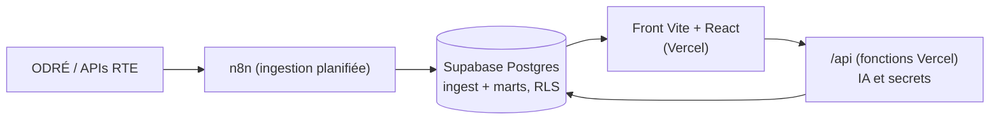

# Courant

[](https://github.com/FaridP92/courant/actions/workflows/ci.yml)

Le command center temps réel de l'électricité française. Que consomme la France maintenant ?
On importe ou on exporte ? Demain, jour rouge ou jour vert ? Courant rend le système
électrique lisible pour tout le monde, à partir des données publiques de RTE.

**En ligne : [courant-sable.vercel.app](https://courant-sable.vercel.app)** ·
[Maquette du command center](https://courant-sable.vercel.app/design/maquette.html)

Projet indépendant, non affilié à RTE. Données : RTE via ODRÉ (open data).

## Ce que montre Courant

- Consommation, production par filière et échanges aux frontières, au quart d'heure
- Signaux Ecowatt (la "météo de l'électricité") et couleurs Tempo
- Un brief quotidien rédigé par IA à partir des chiffres de la veille (jamais l'inverse :
  le modèle rédige, il ne calcule pas)
- Un chat "Pose ta question" adossé à des requêtes SQL générées et validées côté serveur
- Des repères honnêtes : équivalences sourcées, percentiles sur 14 ans d'historique,
  et un affichage explicite quand une source est indisponible (aucune donnée simulée)

## Architecture



Stack : React 19, Vite, TypeScript strict, Tailwind CSS 4, Apache ECharts, TanStack Query,
Supabase Postgres, n8n, fonctions serverless Vercel, API Anthropic.
Décisions structurantes : voir [docs/adr](docs/adr).

## Avancement par phases

- [x] Phase 0 : fondations (CI, tokens design, maquette statique, ADRs, déploiement)
- [ ] Phase 1 : données nationales (schéma et marts livrés, backfill 2012 en cours)
- [ ] Phase 2 : dashboard v1 branché sur les vraies données
- [ ] Phase 3 : régional, carte choroplèthe et flux animés
- [ ] Phase 4 : Ecowatt et Tempo
- [ ] Phase 5 : IA (brief quotidien, chat guardrailed)
- [ ] Phase 6 : micro-insights, machine à remonter le temps, performances
- [ ] Phase 7 : page "Sous le capot", SEO, mise en production

## Développer

```bash
pnpm install
pnpm dev
```

Qualité (tout doit être vert avant commit) :

```bash
pnpm verify        # lint + typecheck + typographie + format + tests + build
pnpm test:e2e      # Playwright (après pnpm build)
```

Le dépôt applique : TDD systématique, TypeScript strict maximal, ESLint strictTypeChecked,
Conventional Commits, et une règle typographique inhabituelle : aucun tiret long, nulle part
(`pnpm check:typo` fait foi).

## Licence et données

Code sous licence [MIT](LICENSE). Les données restent la propriété de leurs producteurs
(RTE, via la plateforme ODRÉ) sous leurs licences respectives, avec attribution affichée
dans l'application.
